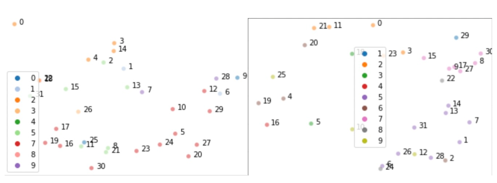
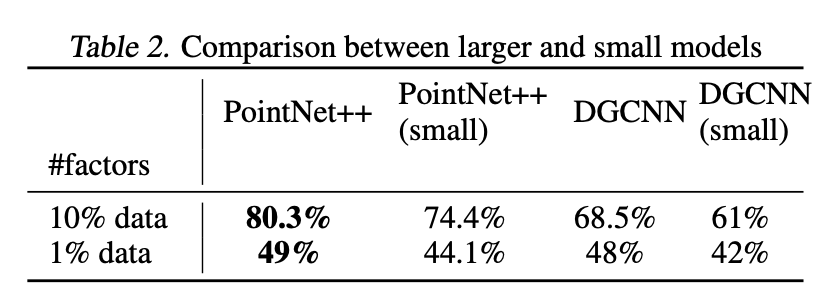
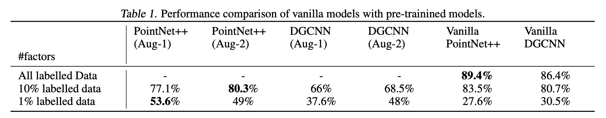

# Contrastive Learning on Point Clouds using Pytorch

This project focuses on exploring the effectiveness of contrastive learning techniques, specifically the SimCLRv2 technique, for learning from non-Euclidean data in the form of point clouds. The project uses the ModelNet10 dataset, which is a subset of the ModelNet40 dataset, and consists of 4,899 CAD-generated meshes in 10 categories. The corresponding point cloud data points are uniformly sampled from the mesh surfaces and further preprocessed by normalizing it.

The project consists of two main stages, pre-training and fine-tuning, implemented in PyTorch. For pre-training, the SimCLRv2 technique is used, which involves maximizing agreement between differently augmented views of the same data example via a contrastive loss in the latent space. The pre-training involves augmenting the data with rotations, translations, shearing, scaling operations, and adding random noise. A deeper encoder and a projection head with higher capacity with more layers are used, and different sets of augmentations are experimented with.

For fine-tuning, the pre-trained model is adapted to a specific task by adjusting the model's parameters. The pre-trained model is fine-tuned from a middle layer of the projection head for the task of classification. Small and large model architectures of PointNet++ and DGCNN are employed, and the models are trained using the Adam optimization algorithm.

The project compares the results of vanilla models with the models that have been pre-trained using different sets of augmentations. It also compares the performance of PointNet++ and Dynamic Graph CNN on two sets of different augmentations. The study concludes that using larger models for pre-training improves the results, and the choice of augmentations and model architecture also influence the results on the downstream task.

## For a detailed explanation, go through the report of the project

